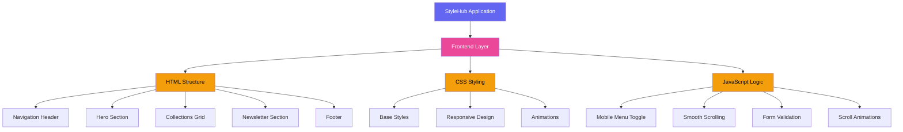
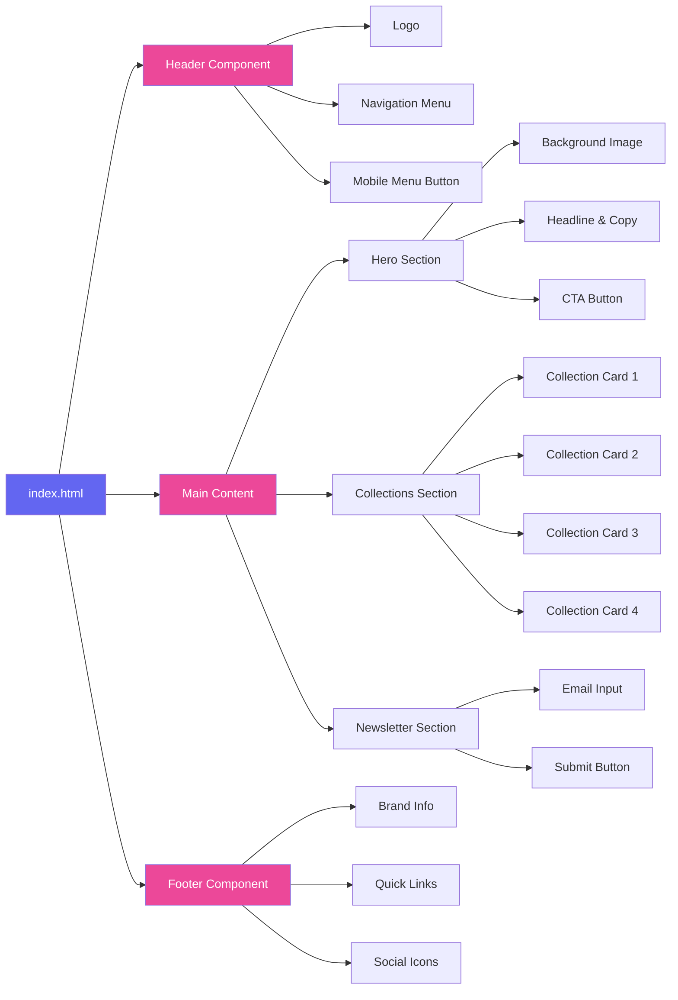
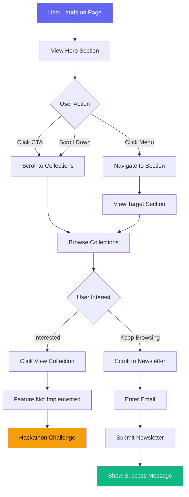
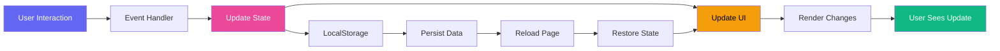
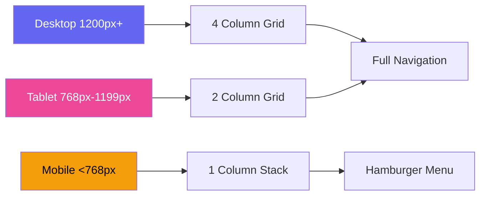
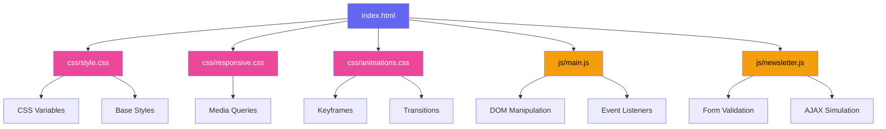
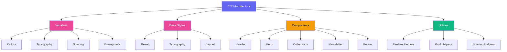
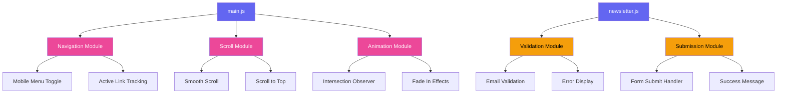
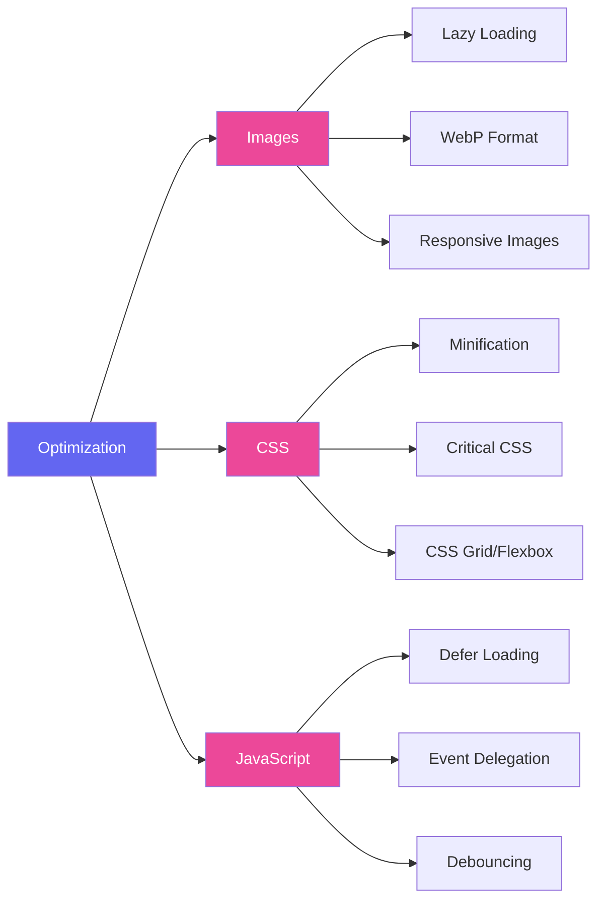

# 🏗️ StyleHub Architecture & Flow

## Application Structure Overview

## Component Hierarchy

## User Flow

## Hackathon Extension Points

```mermaid
graph TB
    Base[Base Application] --> E1[Extension Point 1: Product Pages]
    Base --> E2[Extension Point 2: Shopping Cart]
    Base --> E3[Extension Point 3: Search & Filter]
    Base --> E4[Extension Point 4: User Auth]
    Base --> E5[Extension Point 5: Wishlist]
    Base --> E6[Extension Point 6: Reviews]
    Base --> E7[Extension Point 7: Checkout]
    Base --> E8[Extension Point 8: Theme Toggle]
    
    E1 --> F1[Product Detail View]
    E1 --> F2[Image Gallery]
    E1 --> F3[Size/Color Selection]
    
    E2 --> G1[Cart Modal]
    E2 --> G2[Item Management]
    E2 --> G3[Price Calculation]
    
    E3 --> H1[Search Bar]
    E3 --> H2[Filter Options]
    E3 --> H3[Sort Functionality]
    
    E4 --> I1[Login Form]
    E4 --> I2[Registration]
    E4 --> I3[User Profile]
    
    style Base fill:#6366f1,color:#fff
    style E1 fill:#ec4899,color:#fff
    style E2 fill:#ec4899,color:#fff
    style E3 fill:#ec4899,color:#fff
    style E4 fill:#ec4899,color:#fff
    style E5 fill:#ec4899,color:#fff
    style E6 fill:#ec4899,color:#fff
    style E7 fill:#ec4899,color:#fff
    style E8 fill:#ec4899,color:#fff
```

## Data Flow for Challenges

## Responsive Breakpoints

## File Dependencies

## CSS Architecture

## JavaScript Module Structure

## Performance Optimization Strategy

---

## Key Design Patterns

### 1. Mobile-First Approach
Start with mobile styles, then enhance for larger screens using min-width media queries.

### 2. Progressive Enhancement
Base functionality works without JavaScript, enhanced features added progressively.

### 3. Component-Based Structure
Each section is self-contained and reusable.

### 4. Separation of Concerns
HTML for structure, CSS for presentation, JavaScript for behavior.

### 5. Accessibility First
Semantic HTML, ARIA labels, keyboard navigation support.

---

## Browser Compatibility

Target browsers:
- Chrome 90+
- Firefox 88+
- Safari 14+
- Edge 90+

Features used:
- CSS Grid
- CSS Flexbox
- CSS Variables
- Intersection Observer API
- LocalStorage API
- ES6+ JavaScript

---

## Future Scalability

The architecture supports:
- Adding new sections easily
- Implementing state management
- Integrating with backend APIs
- Converting to React/Vue components
- Adding TypeScript
- Implementing testing frameworks
